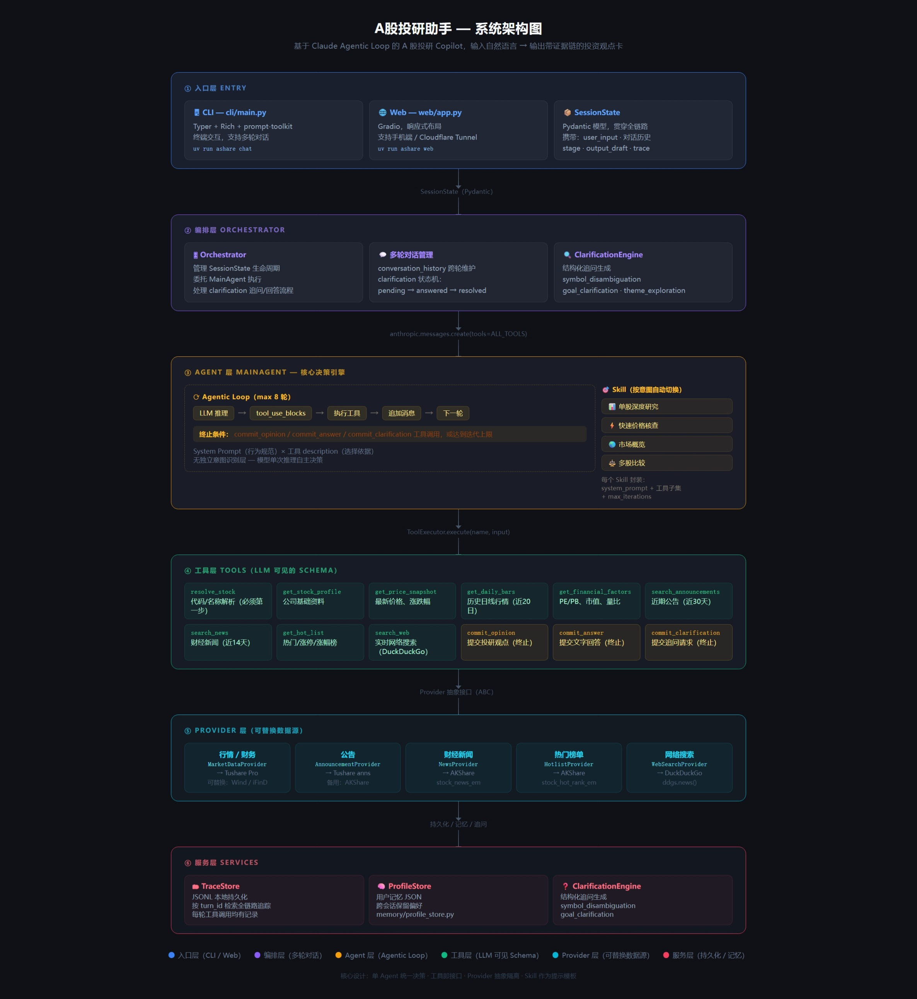

# A股投研助手

A 股投研 Copilot，输入股票代码或自然语言，输出带证据链的投资观点卡。

---

## 界面展示

| 电脑端 — 个股分析 | 电脑端 — 板块分析 | 手机端 |
|---|---|---|
|  |  |  |

---

## 快速开始

```bash
git clone https://github.com/yangyuxin-hub/a-share-research-assistant.git
cd a-share-research-assistant
uv sync
cp .env.example .env   # 填入 ANTHROPIC_API_KEY 和 TUSHARE_TOKEN
```

```bash
uv run ashare chat          # 终端模式
uv run ashare web           # 浏览器模式 http://localhost:7860
uv run ashare check         # 检查配置
```

**公网访问（Cloudflare Tunnel）**

```bash
cloudflared tunnel --url http://localhost:7860 --protocol http2
```

---

## 配置

| 变量 | 说明 | 必需 |
|---|---|---|
| `ANTHROPIC_API_KEY` | Claude API 密钥 | 必须 |
| `ANTHROPIC_BASE_URL` | 中转代理地址 | 可选 |
| `ANTHROPIC_MODEL` | 模型，默认 `claude-sonnet-4-6` | 可选 |
| `TUSHARE_TOKEN` | Tushare token（建议 ≥2000 积分） | 推荐 |

---

## 工具 & Skill

**12 个 LLM 工具**

| 工具 | 说明 |
|---|---|
| `resolve_stock` | 代码/名称解析 |
| `get_stock_profile` | 公司基础资料 |
| `get_price_snapshot` | 最新价格、涨跌幅 |
| `get_daily_bars` | 历史日线行情（默认近 20 日） |
| `get_financial_factors` | PE/PB、市值、量比 |
| `search_announcements` | 近期公告（默认近 30 天） |
| `search_news` | 财经新闻（默认近 14 天） |
| `get_hot_list` | 热门/涨停/涨幅榜 |
| `search_web` | 实时网络搜索 |
| `commit_opinion` | 提交投研结论 |
| `commit_answer` | 直接提交文字回答（知识/问候） |
| `commit_clarification` | 提交追问请求 |

**4 个 Skill（按意图自动选择）**

| Skill | 触发场景 |
|---|---|
| 单股深度研究 | 输入股票代码/名称 |
| 快速价格核查 | 含"多少钱/现价/今天"等词 |
| 市场概览 | 问大盘、板块、宏观事件 |
| 多股比较 | 同时提及 2 只以上股票 |

---

## 数据源

| 数据类型 | 主数据源 | 降级备用 |
|---|---|---|
| 行情 / 因子 / 日线 | Tushare Pro | — |
| 上市公司公告 | Tushare anns | AKShare stock_notice_report |
| 财经新闻 | AKShare stock_news_em | — |
| 热门榜单 | AKShare stock_hot_rank_em | stock_hot_up_em |
| 网络搜索 | DuckDuckGo ddgs.news() | ddgs.text() |

> **注意**：当前数据源为免费/爬取接口，行情为 T+1 非实时，稳定性和准确性有限。生产环境建议替换为 Wind、同花顺 iFinD 等付费接口，Provider 层已做抽象，接口替换成本低。

---

## 系统架构



<details>
<summary>点击展开 ASCII 版本</summary>

```
┌─────────────────────────────────────────────────────────┐
│                      入口层 Entry                        │
│          CLI（Typer + Rich + prompt-toolkit）             │
│          Web（Gradio，支持手机端 / Cloudflare Tunnel）    │
└───────────────────────┬─────────────────────────────────┘
                        │ SessionState（Pydantic）
┌───────────────────────▼─────────────────────────────────┐
│                   编排层 Orchestrator                     │
│   CLISession / WebApp → Orchestrator → MainAgent         │
│   管理多轮对话历史、追问状态（ClarificationEngine）       │
└───────────────────────┬─────────────────────────────────┘
                        │ anthropic.messages.create(tools=…)
┌───────────────────────▼─────────────────────────────────┐
│                  Agent 层 MainAgent                       │
│  ┌──────────────────────────────────────────────────┐   │
│  │              Agentic Loop（max 8 轮）             │   │
│  │  LLM 推理 → tool_use_blocks → 执行 → 追加消息   │   │
│  │  终止条件：commit_opinion / commit_answer /       │   │
│  │            commit_clarification / 迭代上限        │   │
│  └──────────────────────────────────────────────────┘   │
│  System Prompt（行为规范）  ×  工具 description（选择依据）│
└───────────────────────┬─────────────────────────────────┘
                        │ ToolExecutor.execute(name, input)
┌───────────────────────▼─────────────────────────────────┐
│                   工具层 Tool / Skill                     │
│  12 个工具 Schema（LLM 可见）                            │
│    resolve_stock · get_stock_profile · get_price_snapshot│
│    get_daily_bars · get_financial_factors                 │
│    search_announcements · search_news · get_hot_list     │
│    search_web · commit_opinion · commit_answer            │
│    commit_clarification                                  │
│  4 个 Skill（单股深度/快速核查/市场概览/多股比较）     │
└───────────────────────┬─────────────────────────────────┘
                        │ Provider 接口（ABC）
┌───────────────────────▼─────────────────────────────────┐
│  MarketDataProvider ← TushareMarketDataProvider          │
│  AnnouncementProvider ← CninfoAnnouncementProvider        │
│  NewsProvider ← AKShareNewsProvider                      │
│  HotlistProvider ← AKShareHotlistProvider                │
│  WebSearchProvider ← DuckDuckGo（ddgs）               │
└─────────────────────────────────────────────────────────┘
```

</details>

**核心设计决策**

- **单 Agent 统一决策**：意图路由与数据分析合并为一次 LLM 调用，工具 description 即行为规范，无独立意图识别层
- **工具即接口**：`commit_opinion` / `commit_answer` / `commit_clarification` 是 Agent 的"返回值类型"，终止条件通过工具调用表达，而非代码判断
- **Provider 抽象**：数据层以 ABC 接口隔离，当前实现（Tushare / AKShare / DuckDuckGo）可无缝替换为付费数据源
- **Skill 作为提示模板**：每个 Skill 封装 system_prompt + 工具子集 + 迭代上限，场景扩展只需新增 Skill，不改主循环

---

## 设计说明

架构参考了 Claude Code 的 Agentic Loop 设计——单次推理决策、工具 description 驱动行为、无独立意图识别层。当前实现是可用的 MVP，工程上仍有较大优化空间：

- **流式输出**：当前为轮次结束后一次性返回，可改为 token 级流式
- **工具并发**：同轮次多个无依赖工具串行调用，可改为并发执行
- **缓存层**：行情、公告等数据无缓存，相同 symbol 重复请求浪费
- **数据源**：接入付费接口（Wind / iFinD）以提升实时性和稳定性
- **上下文管理**：多轮对话的 token 占用未做压缩，长会话成本较高

---

## 免责声明

本工具仅供个人学习研究，输出内容不构成投资建议。市场有风险，投资需谨慎。
