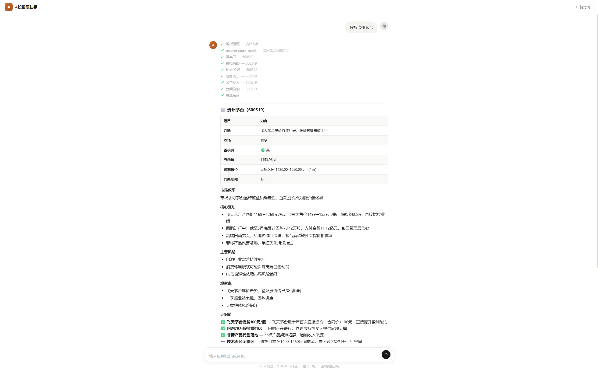
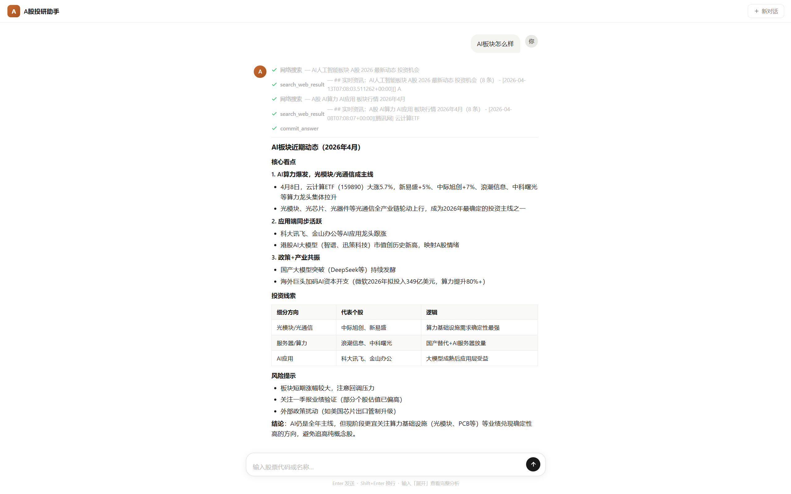
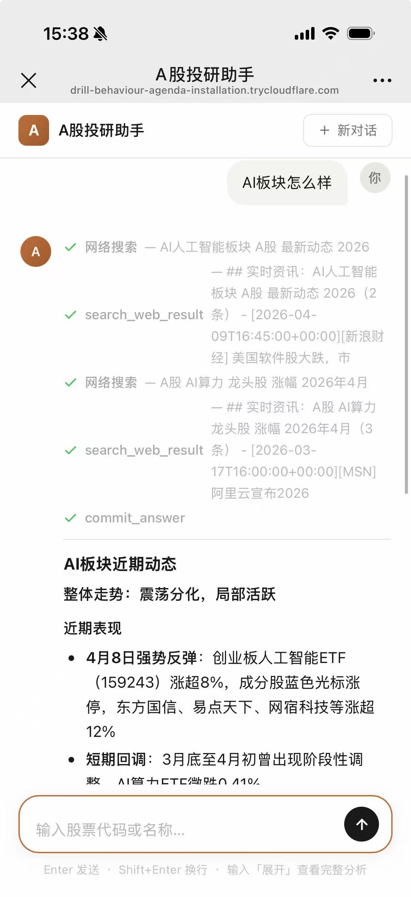

# A股投研助手

A 股投研 Copilot，输入股票代码或自然语言，输出带证据链的投资观点卡。

---

## 界面展示

| 电脑端 — 个股分析 | 电脑端 — 板块分析 | 手机端 |
|---|---|---|
|  |  |  |

---

## 快速开始

```bash
git clone https://github.com/yangyuxin-hub/a-share-research-assistant.git
cd a-share-research-assistant
uv sync
cp .env.example .env   # 填入 ANTHROPIC_API_KEY 和 TUSHARE_TOKEN
```

```bash
uv run ashare chat          # 终端模式
uv run ashare web           # 浏览器模式 http://localhost:7860
uv run ashare check         # 检查配置
```

**公网访问（Cloudflare Tunnel）**

```bash
cloudflared tunnel --url http://localhost:7860 --protocol http2
```

---

## 配置

| 变量 | 说明 | 必需 |
|---|---|---|
| `ANTHROPIC_API_KEY` | Claude API 密钥 | 必须 |
| `ANTHROPIC_BASE_URL` | 中转代理地址 | 可选 |
| `ANTHROPIC_MODEL` | 模型，默认 `claude-sonnet-4-6` | 可选 |
| `TUSHARE_TOKEN` | Tushare token（建议 ≥2000 积分） | 推荐 |

---

## 工具 & Skill

**10 个 LLM 工具**

| 工具 | 说明 |
|---|---|
| `resolve_stock` | 代码/名称解析 |
| `get_stock_profile` | 公司基础资料 |
| `get_price_snapshot` | 最新价格、涨跌幅 |
| `get_daily_bars` | 历史日线行情（默认近 20 日） |
| `get_financial_factors` | PE/PB、市值、量比 |
| `search_announcements` | 近期公告（默认近 30 天） |
| `search_news` | 财经新闻（默认近 14 天） |
| `get_hot_list` | 热门/涨停/涨幅榜 |
| `search_web` | 实时网络搜索 |
| `commit_opinion` | 提交投研结论（触发输出） |

**4 个 Skill（按意图自动选择）**

| Skill | 触发场景 |
|---|---|
| 单股深度研究 | 输入股票代码/名称 |
| 快速价格核查 | 含"多少钱/现价/今天"等词 |
| 市场概览 | 问大盘、板块、宏观事件 |
| 多股比较 | 同时提及 2 只以上股票 |

---

## 数据源

| 数据类型 | 主数据源 | 降级备用 |
|---|---|---|
| 行情 / 因子 / 日线 | Tushare Pro | — |
| 上市公司公告 | Tushare anns | AKShare stock_notice_report |
| 财经新闻 | AKShare stock_news_em | — |
| 热门榜单 | AKShare stock_hot_rank_em | stock_hot_up_em |
| 网络搜索 | DuckDuckGo ddgs.news() | ddgs.text() |

> **注意**：当前数据源为免费/爬取接口，行情为 T+1 非实时，稳定性和准确性有限。生产环境建议替换为 Wind、同花顺 iFinD 等付费接口，Provider 层已做抽象，接口替换成本低。

---

## 免责声明

本工具仅供个人学习研究，输出内容不构成投资建议。市场有风险，投资需谨慎。
